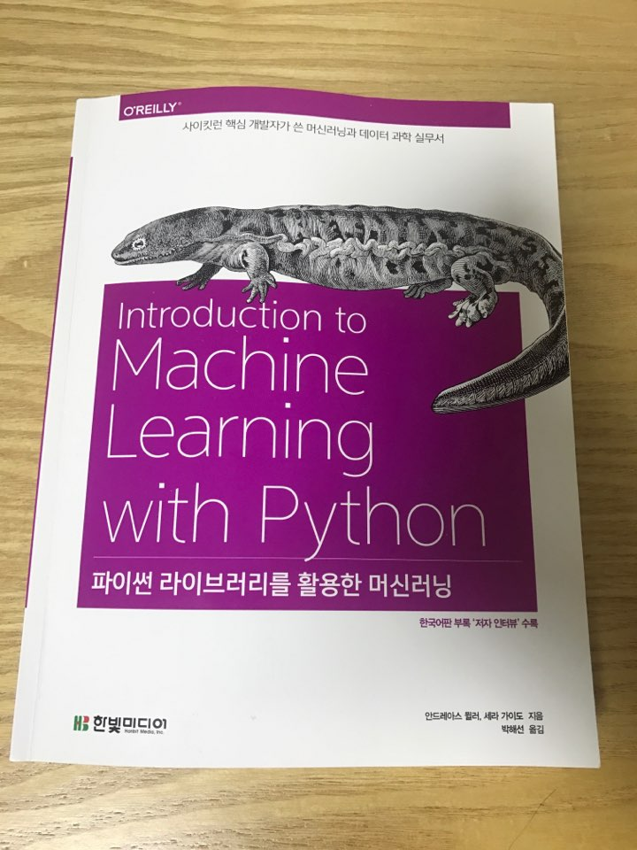
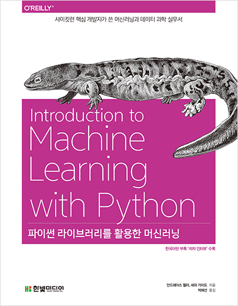

## [리뷰] Introduction to Machine Learning with Python

- 저자: 안드레아스 뮐러, 세라 가이도(Scikit-Learn 핵심개발자), 옮김이: 박해선
- 출간: 2017.7.01
- ISBN: 9788968483394

### 데이터과학과 머신러닝

대학 입학하고 여기저기서 '데이터과학'이란 글귀가 보인다. 미국에서 최고의 연봉을 받는 직종이 데이터 과학자라는 등, 머신러닝은 데이터의 혁명이라는 등, 이 분야에 대한 애찬들이 끊이질 않는다. (딥러닝 기술을 포함한)머신러닝은 현 컴퓨터과학 기술 트렌드의 최전선인 것 같다. 수업 중, 교수님께서는 현재의 트렌드가 아닌 그 다음 트렌드를 준비하라 했지만, 지금 머신러닝이 쓰이는 상황을 보면 머신러닝은 하나의 지나가는 트렌드가 아니라 앞으로도 여러 문재해결의 단초가 될 평생 공부해야 할 기술일지도 모른다.

### 이 책의 내용

이 책은 총 8장으로 나뉘어져 있다. 1장은 머신러닝과 파이썬에 관한 소개, sckit-learn을 포함한 이 책에서 쓰일 여러 라이브러리들(NumPu, SciPy, matplotlib etc)에 관해 이야기한다. 머신러닝 기법은 크게 지도학습/비지도학습으로 나뉘어 2장에서는 k-NN, 회귀을 포함한 지도학습('다중 퍼셉트론'이라는 약간의 딥러닝 내용도 포함되어있다), 3장에서는 군집알고리즘을 포함한 비지도학습 기법에 대해 다룬다. 4장은 데이터 표현과 특성공학을 다루고, 5장에서는 머신러닝 모델에 대한 검증/평가 방법과 성능 향상법을 배운다. 6장에서는 알고리즘 체인 개념과 파이프라인(Pipeline)이라는 파이썬 클래스를 설명하였고 7장은 텍스트 데이터 처리에 관한 방법을 설명한다. 한국어판 부록으로서 koNLPy 파이썬 패키지 활용이 포함된다. 끝으로, 8장에서는 데이터과학자의 길에 관한 저자의 조언이 담겨있다.

### 이 책의 특징

이 책은 필자와 같은 학부 저학년 뿐만 아니라 비전공자를 포함한 모두에게 적절한 수준을 설명함을 목표로 하는 것 같다. 또한 표지에 써있듯이 이 책은 데이터 과학 '실무서'로서, 머신러닝 기법들의 무엇이고 그것을 파이썬 라이브러리(Sckit-Learn)로 어떻게 구현해 당장 써먹을 수 있는 방법을 설명한다. 

그렇다고 해서, 이 책의 저자가 머신러닝의 기법들을 표면적으로만 설명하는 것은 아니다. 이 머신러닝 기법의 특징은 무엇이고 또 다른 기법과 비교하여 장/단점인 무엇이며 어떤 상황에 어울리는 것인지 충분히 이해가 가도록 설명한다. 또한 수식을 활용해 설명한 부분은 모두 주석처리를 해놓아 필요한 때마다 수학적 배경을 알 수 있게 해놓았다. 

'~이다.'가 아닌 '~입니다.'의 어투를 쓴 번역문 덕분에 마치 친근한 과외를 받는 듯한 느낌은 덤이다.

### 이 책의 다음 단계

이 책이 머신러닝의 모든 것과 state-of-art까지를 다루진 않는 것 같다. 하지만 머신러닝의 기초에서 출발 해 더 높은 단계의 것들을 공부하고 익히기 위한 출발점이 될 수 있다고 생각된다.

이 서평의 필자는 데이터 과학자를 꿈꾸지는 않지만, 컴퓨터과학자라면 전산학 이론의 일부로서 머신러닝이란 기술을 꼭 거쳐야 할 '상식'으로 바라본다. 필자는 앞으로도 머신러닝 알고리즘과 이론적 배경들을 알아갈 것이며, 이 책이 